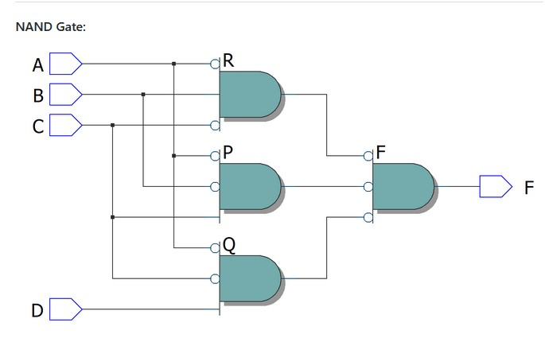

# Experiment--04-Implementation-of-combinational-logic-using-universal-gates-
 ## Implementation-of-Half-subtractor-and-Full-subtractor-circuit
## AIM:
To implement the given logic function using NAND and NOR gates and to verify its operation in Quartus using Verilog programming.
F=((C'.B.A)'(D'.C.A)'(C.B'.A)')' using NAND gate
F=(((C.B'.A)+(D.C'.A)+(C.B'.A))')' using NOR gate

## Equipments Required:
## Hardware – PCs, Cyclone II , USB flasher
## Software – Quartus prime
## Theory
 
 
 
 

## Procedure
1. Module Declaration. module is a keywords defined in Verilog .
2. Input-Output Delecaration. F=((C'.B.A)'(D'.C.A)'(C.B'.A)')' using NAND gate F=(((C.B'.A)+(D.C'.A)+(C.B'.A))')' using NOR gate we have four inputs and one output.
3. Use wire declaration and assign statements to define the functionality of logic circuits.
4. Ending module. endmodule is a keywords defined in Verilog.

## Program:
/*
~~~
Program to design a Implementation of combinational logic using universal gates-  and verify its truth table in quartus using Verilog programming.
Developed by: u.srinivas
RegisterNumber:  212221230108

NAND GATE :
module unand(A,B,C,D,Y);
input A,B,C,D;
output Y;
wire P,Q,R;
assign P = C&(~B)&(~A);
assign Q = D&(~C)&(~A);
assign R = (~C)&B&(~A);
assign Y = (~P&~Q&~R);
endmodule

NOR GATE :
module norunigate(A,B,C,D,F);
input A,B,C,D;
output F;
wire b,c,P,Q,R,Y;
assign b= ~B;
assign c= ~C;
assign P= C & b & A;
assign Q= D & c & A;
assign R= C & b & A;
nor(Y,P,Q,R);
assign F = ~Y;
endmodule
*/
~~~
## Output:

## Truthtable

##  RTL realization

## Timing diagram 

## Result:
Thus the implementation of the given logic function using NAND and NOR gates is done and verification its operation in Quartus using Verilog programming is carried out sucessfully.
 
